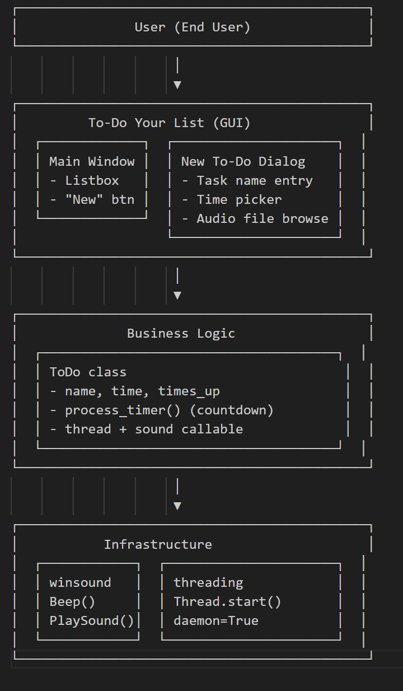
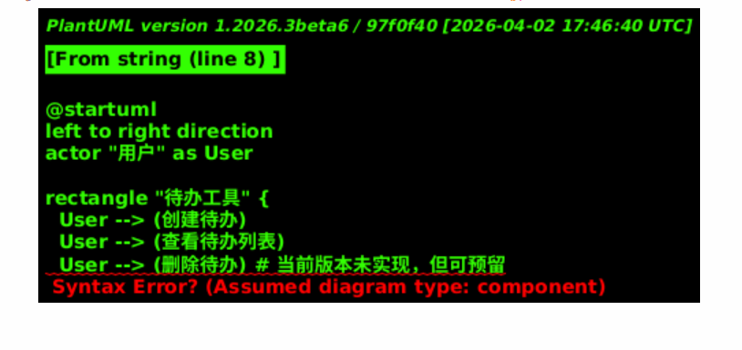
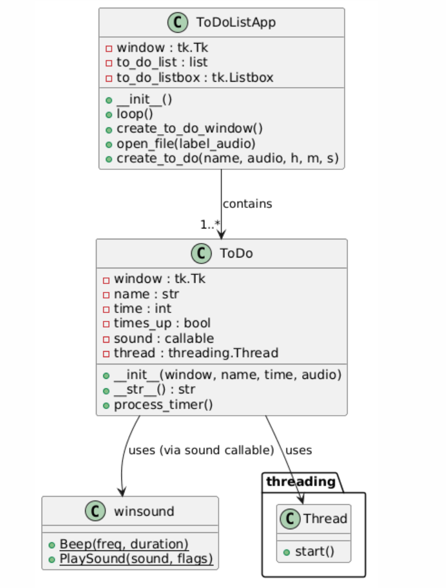

# To-Do-Your-List
a small app for the computer lover but have their procrastination

# Usage
Click the *Start a To-Do* button to add new To-Do task.

Click the *Check if press button* button to see when you last pressed the button.

# Configurable
You can choose your preferred language.

You can choose your favorite ringtone.

## 1. Graphical Abstract

## 2. Purpose of the Software
- **开发流程选型**：我们采用 **Agile (Scrum)** 而非瀑布模型，因为笔记工具的需求会随着用户反馈快速迭代（例如：输入代办事项名称、倒计时、闹钟倒计时，文档Markdown 支持等），敏捷开发允许我们每 1-2 天交付一个可用的增量版本。
                                                 
通过每日站会和 小组 评审，能及时调整优先级，避免瀑布模型后期修改需求的高成本。
我们使用 Git 进行版本管理，GitHub Issues 管理用户故事和任务，GitHub Actions 做持续集成，支持快速迭代。

通过每日站会和 Sprint 评审，能及时调整优先级，避免瀑布模型后期修改需求的高成本。
我们使用 Git 进行版本管理，GitHub Issues 管理用户故事和任务，GitHub Actions 做持续集成，支持快速迭代。

- **目标用户**：大学生及知识工作者，需要一个轻量级的代办工具。

## 3. Software Development Plan

### 3.1 团队成员角色与分工
| 姓名 | 角色 | 工作量占比 |
|-------|---------------------|------------|
| 許駿恆 | 内容实现和完善与宣传 / 后端 | 50% |
| 刘灏   | 框架设计和测试与文档 |  50% |

### 3.2 Sprint 计划表

### 3.3 核心算法简述
- 使用 **bcrypt** 进行密码哈希加盐存储。
- 笔记搜索采用 **TF-IDF** 进行关键词匹配（引用 `scikit-learn` 库）。

### 3.4 当前状态与未来计划
- **当前**：功能测试集成完毕，后续处理readme，文档补全和演示视频。
- **未来**：增加To-do-list分享功能，支持 Markdown 实时预览。

## 4. 系统设计模型
### 用例图

### 类图

## 5. 外部引用声明

